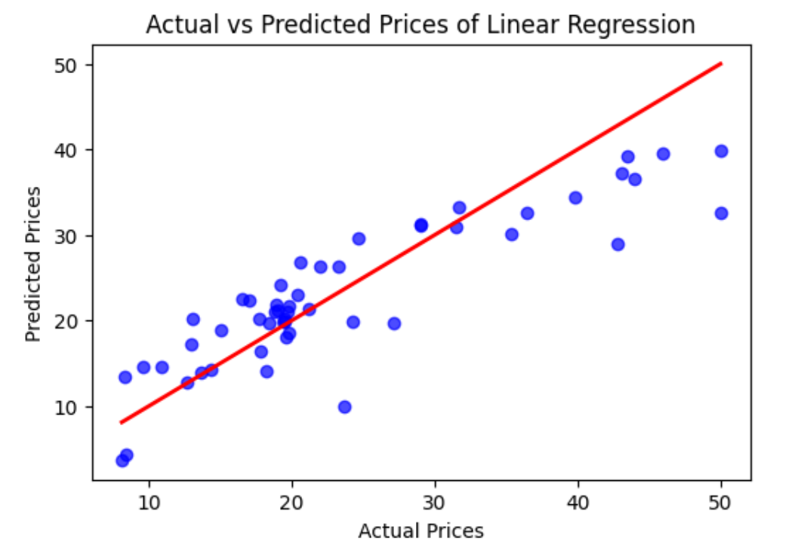
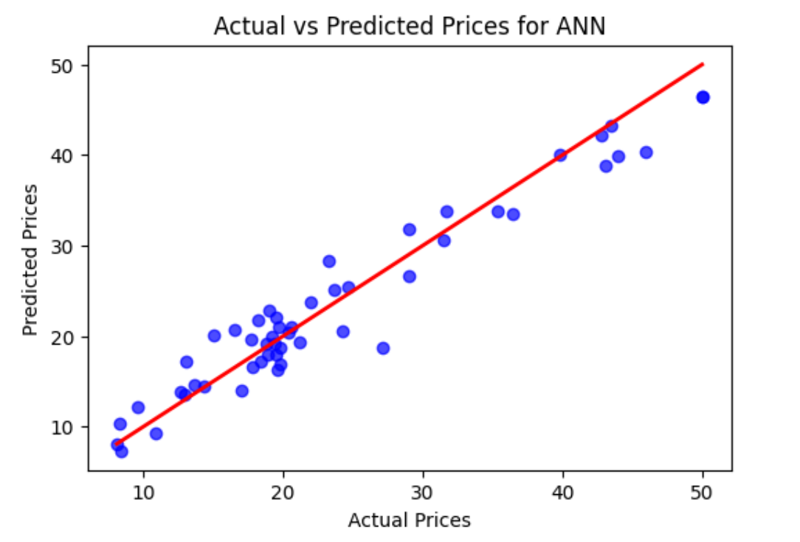

# Housing Prices Prediction

## Overview
This project aims to predict the median value of owner-occupied homes in the Boston area using a linear regression model. The dataset used contains various features that potentially influence housing prices. 

## Dataset and Features
The dataset contains 14 features including the target variable 'MEDV' which represents the median value of owner-occupied homes in $1000's. The features include:
- `CRIM`: Per capita crime rate by town.
- `ZN`: Proportion of residential land zoned for lots over 25,000 sq. ft.
- `INDUS`: Proportion of non-retail business acres per town.
- `CHAS`: Charles River dummy variable (1 if tract bounds river; 0 otherwise).
- `NOX`: Nitric oxides concentration (parts per 10 million).
- `RM`: Average number of rooms per dwelling.
- `AGE`: Proportion of owner-occupied units built prior to 1940.
- `DIS`: Weighted distances to five Boston employment centers.
- `RAD`: Index of accessibility to radial highways.
- `TAX`: Full-value property tax rate per $10,000.
- `PTRATIO`: Pupil-teacher ratio by town.
- `B`: 1000(Bk - 0.63)^2 where Bk is the proportion of Black residents by town.
- `LSTAT`: Percentage of lower status of the population.
- `MEDV`: Median value of owner-occupied homes in $1000's.

## Data Preprocessing Steps
1. Loaded and inspected the dataset.
2. No missing values were found in the dataset.
3. Performed feature scaling and normalization using `StandardScaler`.
4. Split the data into training and testing sets (80% training, 20% testing).

## Model Training and Evaluation
- Implemented a simple Linear Regression model and One ANN model.
- Trained them on the training dataset.
- Evaluated both the models using Mean Absolute Error (MAE), Mean Squared Error (MSE), and Root Mean Squared Error (RMSE).

## Interpretation of Coefficients
The coefficients of the linear regression model provide insights into the impact of each feature on the housing prices. A positive coefficient indicates that an increase in the feature value leads to an increase in the predicted price, while a negative coefficient indicates a decrease.

## Challenges Faced
- Ensuring proper feature scaling and normalization.
- Splitting the data in a manner that maintains the distribution of the target variable.

## Conclusion
The linear regression model provides a baseline for predicting housing prices. Future improvements can include exploring more complex models, performing feature engineering, and hyperparameter tuning to enhance model performance.

## Visualization
The following plot shows the actual vs. predicted housing prices:

## Usage
To use this project:
1. Clone the repository.
2. Install the required dependencies.
3. Run the script to train the model and evaluate its performance.

## Dependencies
- pandas
- numpy
- scikit-learn
- matplotlib

## How to Run
1. Clone this repository: `git clone 'https://github.com/MrProgrammerr/Housing-Price-Prediction'`
2. Navigate to the project directory: `cd 'path/Housing-Price-Prediction'`
3. Install the required dependencies: `pip install -r requirements.txt`
4. Run the notobook: `House_Price_Prediction.ipynb`

## Author
Chandan Kumar Nayak
